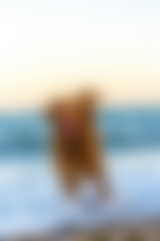
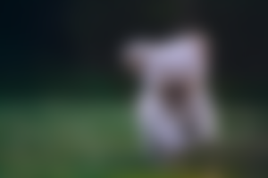
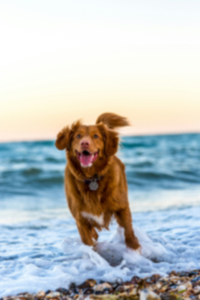
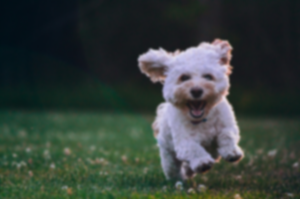
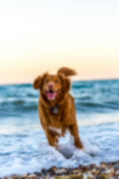

# Blur Advanced

This instruction will add a blurring effect as well as different types of blurring

| Name     | Data Type | Accepted Parameter(s)                                                    | Minimum Value | Maximum Value | Description                                                        |
|----------|-----------|--------------------------------------------------------------------------|---------------|---------------|--------------------------------------------------------------------|
| process  | String    | bluradvanced                                                             | NA            | NA            | Set type of process                                                |
| blurtype | String    | anisotropic, kernel, radius, sigma, smooth_3, smooth_5, smooth_7, kernel | 0             | 1,000         | Set type of blur type                                              |
| value    | String    | NA                                                                       | 0             | 1,000         | Set level of blurring                                              |
|     |     |                                                                        | [0,0]         | [1000,1000]   | Anisotropic only. Set level of blurring as an array|


## Examples

## Set blur type to anisotropic. Set array to [10,10]

Instructions: Set blur type to anisotropic. Set array to [10,10]
````
{"process": "bluradvanced", "blurtype": "anisotropic", "value": "10,10"}
````

| Original Image                     | Updated Image                          |
|------------------------------------|----------------------------------------|
|  |  |
|  |  |

## Set blur type to kernel. Set value to 10

Instructions: Set blur type to kernel. Set value to 10
````
{"process": "bluradvanced", "blurtype": "kernel", "value": "10"}
````

| Original Image                     | Updated Image                          |
|------------------------------------|----------------------------------------|
|  |  |
|  |  |

## Set blur type to sigma. Set value to 10

Instructions: Set blur type to sigma. Set value to 10
````
{"process": "bluradvanced", "blurtype": "sigma", "value": "10"}
````

| Original Image                     | Updated Image                          |
|------------------------------------|----------------------------------------|
|  |  |
|  |  |

## Set blur type to smooth_3. Cannot set value

Instructions: Set blur type to smooth_3. Cannot set value
````
{"process": "bluradvanced", "blurtype": "smooth_3"}
````

| Original Image                     | Updated Image                          |
|------------------------------------|----------------------------------------|
|  |  |
|  |  |

## Set blur type to smooth_5. Cannot set value

Instructions: Set blur type to smooth_5.
````
{"process": "bluradvanced", "blurtype": "smooth_5"}
````

| Original Image                     | Updated Image                                   |
|------------------------------------|-------------------------------------------------|
|  |  |
|  |  |

## Set blur type to smooth_7. Cannot set value

Instructions: Set blur type to smooth_7. Cannot set value
````
{"process": "bluradvanced", "blurtype": "smooth_7"}
````

| Original Image                     | Updated Image                                   |
|------------------------------------|-------------------------------------------------|
|  |  |
|  |  |


