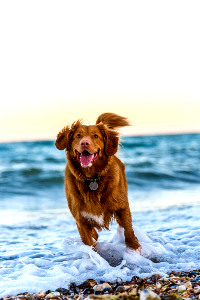
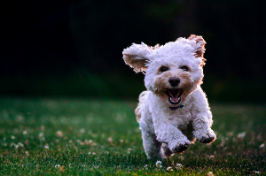
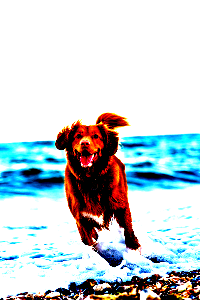
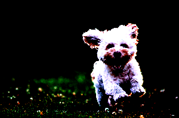

# Contrast

This instruction will add a contrast effect

| Name    | Data Type | Accepted Parameter(s) | Minimum Value | Maximum Value | Description              |
|---------|-----------|-----------------------|---------------|---------------|--------------------------|
| process | String    | contrast              | NA            | NA            | Set type of process      |
| value   | String    | NA                    | 0             | 1,000         | Set level of brightening |


## Examples

## Contrast image to 10

Instructions: Set contrast to 10
````
{"process": "contrast", "value": "10"}
````

| Original Image                     | Updated Image                         |
|------------------------------------|---------------------------------------|
|  |  |
|  |  |

## Contrast image to 100

Instructions: Set contrast to 100
````
{"process": "contrast", "value": "100"}
````

| Original Image                     | Updated Image                          |
|------------------------------------|----------------------------------------|
|  |  |
|  |  |