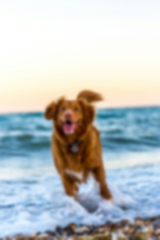
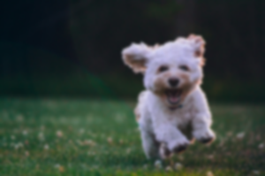
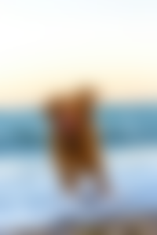
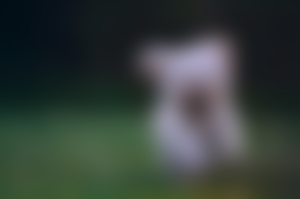

# FastBlur

This instruction will add a blurring effect

| Name    | Data Type | Accepted Parameter(s) | Minimum Value | Maximum Value | Description           |
|---------|-----------|-----------------------|---------------|---------------|-----------------------|
| process | String    | fastblur              | NA            | NA            | Set type of process   |
| value   | String    | NA                    | 0             | 1,000         | Set level of blurring |


## Examples

## Fastblur to 1

Instructions: Set Fastblur to 1
````
{"process": "fastblur", "value": "1"}
````

| Original Image                     | Updated Image                        |
|------------------------------------|--------------------------------------|
|  |  |
|  |  |

## Fastblur to 10

Instructions: Set Fastblur to 10
````
{"process": "fastblur", "value": "100"}
````

| Original Image                     | Updated Image                         |
|------------------------------------|---------------------------------------|
|  |  |
|  |  |

## Fastblur to 25

Instructions: Set Fastblur to 25
````
{"process": "fastblur", "value": "25"}
````

| Original Image                     | Updated Image                         |
|------------------------------------|---------------------------------------|
|  |  |
|  |  |