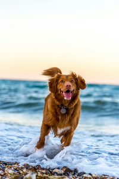
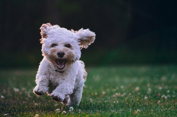
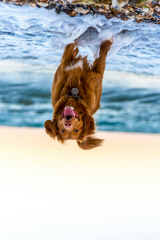
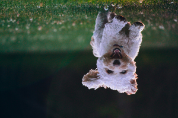
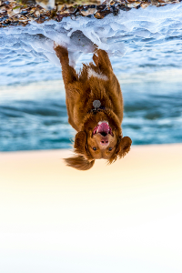

# Flip

This instruction will flip images horizontally, vertically, or both. You can use both by running instructions one after the other.

| Paraneter | Value Type | Accepted Value | Description              |
|-----------|------------|----------------|--------------------------|
| process   | String     | flip           | Set process type                        |
| value     | String     | h              | Flips image horizontally |
| value     | String     | v              | Flips image vertically |


## Examples

## Flip H

Instructions: Flip image horizontally
````
{"process": "flip", "value": "h"}
````

| Original Image                     | Updated Image                    |
|------------------------------------|----------------------------------|
|  |  |
|  |  |

## Flip V

Instructions: Flip image vertically
````
{"process": "flip", "value": "v"}
````

| Original Image                     | Updated Image                    |
|------------------------------------|----------------------------------|
|  |  |
|  |  |

## Flip H and V

Instructions: Flip image horziontally and vertically
````
{"process": "flip", "value": "h"},
{"process": "flip", "value": "v"}
````

| Original Image                     | Updated Image                          |
|------------------------------------|----------------------------------------|
|  |  |
|  |  |