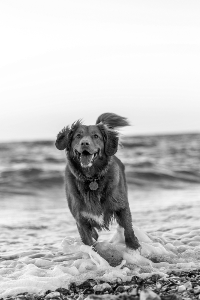
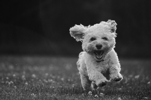

# Grayscale

This instruction will create grayscale images.


| Paraneter | Value Type | Accepted Values | Description                             |
|-----------|------------|-----------------|-----------------------------------------|
| process   | String     | graycale        | Set process type                        |
| value     | NA         | NA              | This process does not accept any values |


## Example

## Grayscale

Instructions: Set images to grayscale
````
{"process": "grayscale"}
````

| Original Image                     | Updated Image                       |
|------------------------------------|-------------------------------------|
|  |  |
|  |  |
