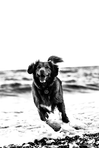
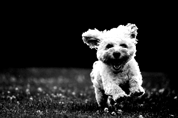
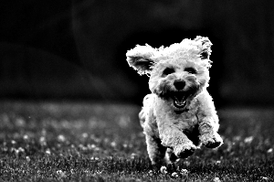

# Grayscale

This instruction will create grayscale images.

| Name    | Data Type | Accepted Parameter(s) | Minimum Value | Maximum Value | Description         |
|---------|-----------|-----------------------|---------------|---------------|---------------------|
| process | String    | grayscale             | NA            | NA            | Set type of process |
| value   | NA        | NA                    | NA            | NA            | NA                  |

You do not need to set a value for grayscale. This process does not accept any values


## Example

## Grayscale

Instructions: Set images to grayscale
````
{"process": "grayscale"}
````

| Original Image                     | Updated Image                       |
|------------------------------------|-------------------------------------|
|  |  |
|  |  |

## Combining effects before setting grayscale

Setting the image as grayscale alone may not give you the desired results. However, you can combine different processes
before applying a grayscale effect to it. For example, you may to add a brightness, contrast, and/or unsharpen effect
before rendering it as grayscale. See examples below.

Instructions: Set brighteness and contrast with image before rendering it as grayscale
````
{"process": "brighten", "value": "10"},
{"process": "contrast", "value": "50"},
{"process": "grayscale"}
````

| Original Image                     | Updated Image                                |
|------------------------------------|----------------------------------------------|
|  |  |
|  |  |

Instructions: Set unsharpen and contrast with image before rendering it as grayscale
````
{"process": "unsharpen", "value": "10"},
{"process": "contrast", "value": "5"},
{"process": "grayscale"}
````

| Original Image                     | Updated Image                                |
|------------------------------------|----------------------------------------------|
|  |  |
|  |  |
