# Hue Rotate

This instruction will rotate the hue of the images from 0 to 360 degrees. You can rotate over 360 degrees, 
but a hue at 450 degrees will render the same image as at 90 degrees. It would make no difference.


| Parameter | Value Type | Minimum Value | Maximum Value | Description               |
|-----------|------------|--------------|---------------|---------------------------|
| process   | String     | huerotate    | Set process type                        |
| value     | String     | 0            | 360           | Rotates hue from 0 to 360 |


## Examples

## Hue Rotate 100 degrees

Instructions: Hue rotate to 100 degrees
````
{"process": "huerotate", "value": "100"}
````

| Original Image                     | Updated Image                            |
|------------------------------------|------------------------------------------|
|  | 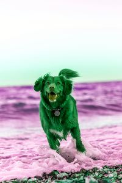 |
|  | 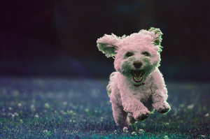 |

## Hue Rotate 150 degrees

Instructions: Hue rotate to 150 degrees
````
{"process": "huerotate", "value": "150"}
````

| Original Image                     | Updated Image                            |
|------------------------------------|------------------------------------------|
|  | 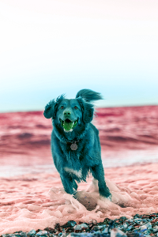 |
|  | 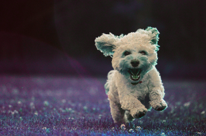 |

## Hue Rotate 200 degrees

Instructions: Hue rotate to 200 degrees
````
{"process": "huerotate", "value": "200"}
````

| Original Image                     | Updated Image                            |
|------------------------------------|------------------------------------------|
|  | 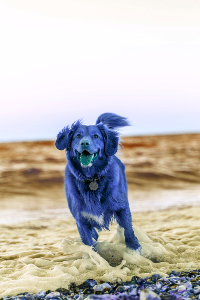 |
|  | 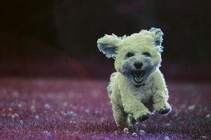 |

## Hue Rotate 240 degrees

Instructions: Hue rotate to 240 degrees
````
{"process": "huerotate", "value": "240"}
````

| Original Image                     | Updated Image                            |
|------------------------------------|------------------------------------------|
|  | 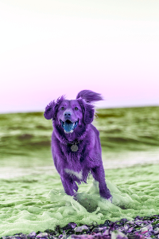 |
|  | 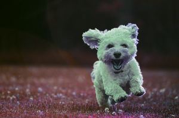 |


## Interesting Effect

You can create an interesting effect by hue rotating an image that's already been hue rotated. We
have an image of a dog that's been rendered as green. What would happen if we re-run the same process with the image? 
You can see the effect for each one below

| Original Image                           | Updated Image                                  | Description       |
|------------------------------------------|------------------------------------------------|-------------------|
| 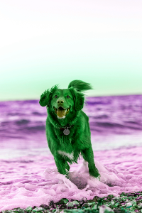 | 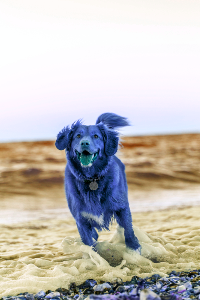 | Hue rotate to 100 |
|  | 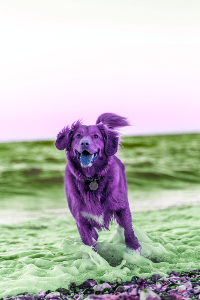 | Hue rotate to 150 |
|  | 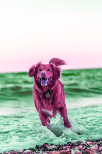 | Hue rotate to 200 |
|  | 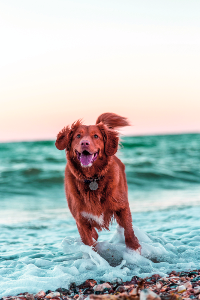 | Hue rotate to 240 |