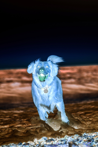
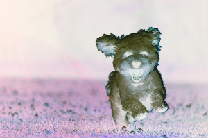

# Invert

This instruction will create inverted images. It reverses the colour of images.

| Name    | Data Type | Accepted Parameter(s) | Minimum Value | Maximum Value | Description         |
|---------|-----------|-----------------------|---------------|---------------|---------------------|
| process | String    | invert                | NA            | NA            | Set type of process |
| value   | NA        | NA                    | NA            | NA            | NA                  |

You do not need to set a value for grayscale. This process does not accept any values


## Example

## Invert

Instructions: Set images to be inverted
````
{"process": "invert"}
````

| Original Image                     | Updated Image                    |
|------------------------------------|----------------------------------|
|  |  |
|  |  |

