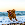
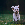
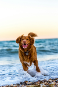
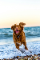
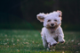
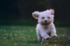
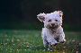

# Resize

This instruction will resize images . Due to Rust Image package, it's limited to rotating images to 90, 180, 270, and 360 degrees.


| Name             | Data Type | Accepted Parameter(s)                             | Minimum Value | Maximum Value | Description                                                        |
|------------------|-----------|---------------------------------------------------|---------------|---------------|--------------------------------------------------------------------|
| process          | String    | resize                                            | NA            | NA            | Set type of process                                                |
| value            | String    | Any value with %, px, or none                     | 1%            | 1,000%        | Resize image by percentage                                         |
|                  |           |                                                   | 1px           | 1,00px        | Resize image by pixels                                             |
| width            | String    | Any value with %, px, or none                     | 1%            | 1,000%        | Resize image width by percentage                                   |
|                  |           |                                                   | 1px           | 1,00px        | Resize image width by pixels                                       |
| height           | String    | Any value with %, px, or none                     | 1%            | 1,000%        | Resize image height by percentage                                  |
|                  |           |                                                   | 1px           | 1,000px       | Resize image height by pixels                                      |
| resizefiltertype | String    | CatmullRom, Gaussian, Lanczos3, Nearest, Triangle | NA            | NA            | Resize Filter Type. Different formulas are used in resizing images |

If percentage or pixels are NOT set in the value, width and height, e.g. 10% or 10px, it will default to pixels. 
If resizefiltertype is not set either, it will default to nearest

## Percent and Pixels Examples

## Resize image to 25 pixels as default

Instructions: Resize to 25 pixels, without setting px or %. Applies to both width and height. 
It will default to using pixels. Resize Filter Type defaults to nearest.
````
{"process": "resize", "value": "25"}
````

| Original Image                     | Updated Image                       |
|------------------------------------|-------------------------------------|
|  |  |
|  |  |

## Resize image to 25%

Instructions: Resize to 25%. Applies to both width and height. Resize Filter Type defaults to nearest.
````
{"process": "resize", "value": "25%"}
````

| Original Image                     | Updated Image                               |
|------------------------------------|---------------------------------------------|
|  |  |
|  |  |

## Resize image to 25% in width and height

Instructions: Resize to 25% in width and height. Resize Filter Type defaults to nearest.
````
{"process": "resize", "width": "25%", "height":  "25%"}
````

| Original Image                     | Updated Image                                              |
|------------------------------------|------------------------------------------------------------|
|  |    |
|  |    |


## Resize image to 50%

Instructions: Resize to 50%. Applies to both width and height. Resize Filter Type defaults to nearest.
````
{"process": "resize", "value": "50%"}
````

| Original Image                     | Updated Image                               |
|------------------------------------|---------------------------------------------|
|  |  |
|  |  |


## Resize image to 45% width and 75% height 

Instructions: Resize image to 45% width and 75% height. Resize Filter Type defaults to nearest.
````
{"process": "resize", "width": "45%", "height":  "75%"}
````

| Original Image                     | Updated Image                                            |
|------------------------------------|----------------------------------------------------------|
|  |  |
|  |  |

## Resize image to 45px width and 75px height

Instructions: Resize image to 50px width and 75px height. Resize Filter Type defaults to nearest.
````
{"process": "resize", "width": "50px", "height":  "75px"}
````

| Original Image                     | Updated Image                                            |
|------------------------------------|----------------------------------------------------------|
|  |  |
|  |  |

## Resize Filter Type Examples

## Resize image using Catmullrom

Instructions: Resize to 30%. Applies to both width and height. Resize Filter Type is set as Catmullrom
````
{"process": "resize", "value": "30%", "resizefiltertype": "catmullrom"}
````

| Original Image                     | Updated Image                                          |
|------------------------------------|--------------------------------------------------------|
|  |  |
|  |  |

## Resize image using Gaussian

Instructions: Resize to 30%. Applies to both width and height. Resize Filter Type is set as Gaussian
````
{"process": "resize", "value": "30%", "resizefiltertype": "gaussian"}
````

| Original Image                     | Updated Image                                        |
|------------------------------------|------------------------------------------------------|
|  |  |
|  |  |

## Resize image using Lanczos3

Instructions: Resize to 30%. Applies to both width and height. Resize Filter Type is set as Lanczos3
````
{"process": "resize", "value": "30%", "resizefiltertype": "lanczos3"}
````

| Original Image                     | Updated Image                                        |
|------------------------------------|------------------------------------------------------|
|  |  |
|  |  |

## Resize image using Nearest

Instructions: Resize to 30%. Applies to both width and height. Resize Filter Type is set as Nearest
````
{"process": "resize", "value": "30%", "resizefiltertype": "nearest"}
````

| Original Image                     | Updated Image                                       |
|------------------------------------|-----------------------------------------------------|
|  |  |
|  |  |

## Resize image using Triangle

Instructions: Resize to 30%. Applies to both width and height. Resize Filter Type is set as Nearest
````
{"process": "resize", "value": "30%", "resizefiltertype": "Triangle"}
````

| Original Image                     | Updated Image                                        |
|------------------------------------|------------------------------------------------------|
|  |  |
|  |  |