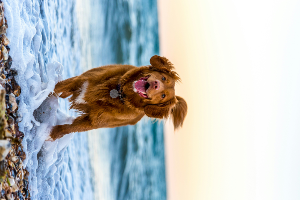
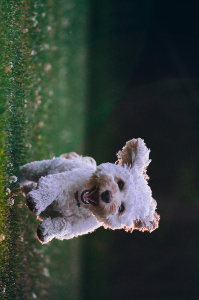
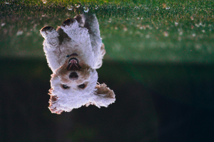
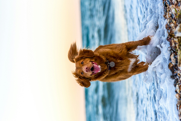
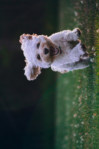
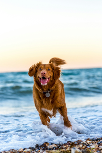

# Rotate

This instruction will rotate images. Due to Rust Image package, it's limited to rotating images to 90, 180, 270, and 360 degrees.


| Paraneter | Value Type | Accepted Values   | Description               |
|-----------|------------|-------------------|---------------------------|
| process   | String     | rotate            | Set process type                        |
| value     | String     | 90, 180, 270, 360 | Rotates hue from 0 to 360 |


## Examples

## Rotate 90 degrees

Instructions: Rotate to 90 degrees
````
{"process": "rotate", "value": "90"}
````

| Original Image                     | Updated Image                       |
|------------------------------------|-------------------------------------|
|  |  |
|  |  |

## Rotate 180 degrees

Instructions: Rotate to 180 degrees
````
{"process": "rotate", "value": "180"}
````

| Original Image                     | Updated Image                        |
|------------------------------------|--------------------------------------|
|  |  |
|  |  |

## Rotate 270 degrees

Instructions: Rotate to 270 degrees
````
{"process": "rotate", "value": "270"}
````

| Original Image                     | Updated Image                        |
|------------------------------------|--------------------------------------|
|  |  |
|  |  |

## Rotate 360 degrees

Instructions: Rotate to 360 degrees. This feature makes no degree. Maybe removed in future.
````
{"process": "rotate", "value": "360"}
````

| Original Image                     | Updated Image                        |
|------------------------------------|--------------------------------------|
|  |  |
|  |  |