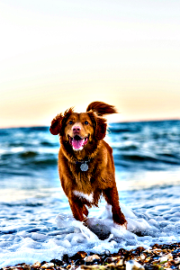
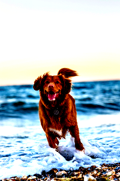
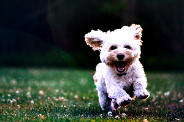
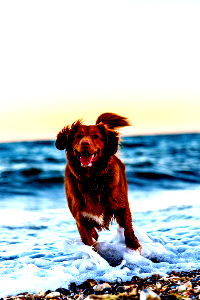
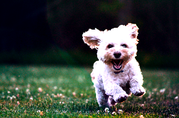
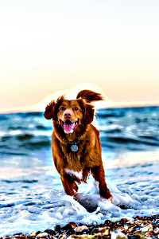
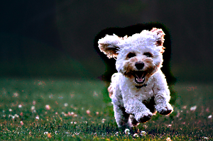
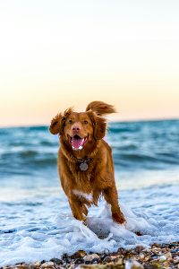
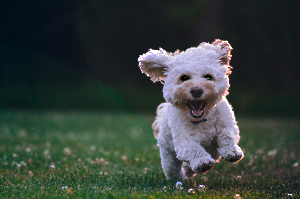

# Unsharpen

This instruction will add a unsharpening effect

| Name               | Data Type | Accepted Parameter(s) | Minimum Value | Maximum Value | Description               |
|--------------------|-----------|-----------------------|---------------|---------------|---------------------------|
| process            | String    | unsharpen             | NA            | NA            | Set type of process       |
| value              | String    | NA                    | 0             | 1,000         | Set level of unsharpening |
| unsharpenthreshold | String    | NA                    | 0             | 1,000         | Set threshold. Optional   |


## Examples

## Unsharpen image to 10

Instructions: Set Unsharpen to 10. No threshold
````
{"process": "unsharpen", "value": "10"}
````

| Original Image                     | Updated Image                          |
|------------------------------------|----------------------------------------|
|  |  |
|  |  |

## Unsharpen image to 50

Instructions: Set Unsharpen to 50. No threshold
````
{"process": "unsharpen", "value": "50"}
````

| Original Image                     | Updated Image                          |
|------------------------------------|----------------------------------------|
|  |  |
|  |  |

## Unsharpen image to 100

Instructions: Set Unsharpen to 100. No threshold
````
{"process": "unsharpen", "value": "100"}
````

| Original Image                     | Updated Image                           |
|------------------------------------|-----------------------------------------|
|  |  |
|  |  |

## Unsharpen image to 10. Set threshold to 20

Instructions: Set Unsharpen to 10, set threshold to 20
````
{"process": "unsharpen", "value": "10", "unsharpenthreshold": "20"}
````

| Original Image                     | Updated Image                                       |
|------------------------------------|-----------------------------------------------------|
|  |  |
|  |  |

## Unsharpen image to 10. Set threshold to 100

Instructions: Set Unsharpen to 10, set threshold to 100
````
{"process": "unsharpen", "value": "10", "unsharpenthreshold": "100"}
````

| Original Image                     | Updated Image                                        |
|------------------------------------|------------------------------------------------------|
|  |  |
|  |  |

